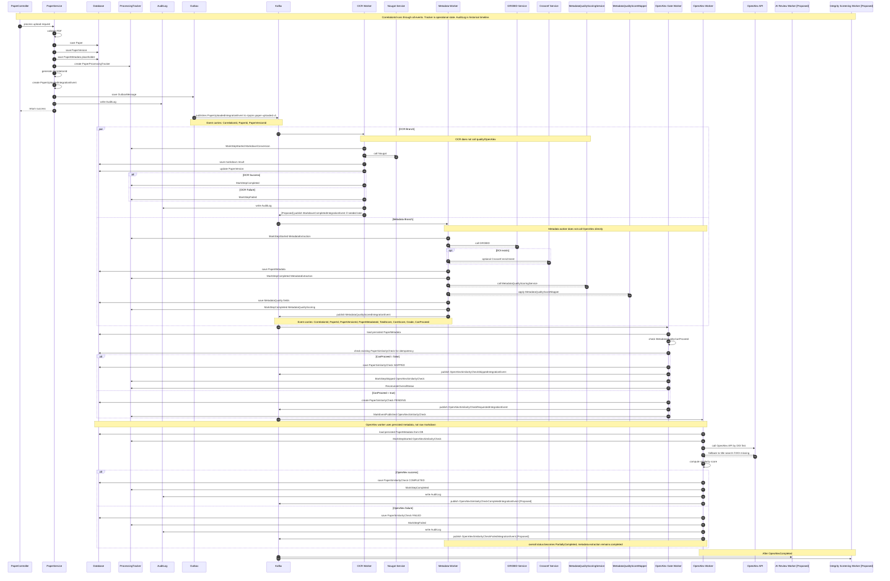

# RIPQMS Code-To-Mermaid Event Pipeline

This document is derived from the current RIPQMS implementation. It shows the full upload processing lifecycle from PDF upload to OCR, metadata extraction, metadata quality scoring, OpenAlex similarity checking, tracker updates, and audit logging.

## Source Files / Classes Discovered

- API upload entrypoint: `PaperController.Upload`
- Upload orchestration: `PaperService.UploadPaperAsync`
- Outbox publisher: `KafkaOutboxPublisherBackgroundService`
- Upload event: `PaperUploadedIntegrationEvent`
- Kafka configuration: `KafkaOptions`
- OCR worker: `PaperOcrKafkaConsumerBackgroundService`
- OCR service: `INougatService`
- Metadata worker: `PaperMetadataKafkaConsumerBackgroundService`
- Metadata services: `IGrobidService`, `ICrossrefService`
- Metadata quality service: `IMetadataQualityScoringService`
- Metadata quality mapper: `MetadataQualityScoreMapper`
- OpenAlex gate worker: `OpenAlexGateKafkaConsumerBackgroundService`
- OpenAlex worker: `OpenAlexSimilarityKafkaConsumerBackgroundService`
- OpenAlex service: `IOpenAlexService`
- Similarity result entity: `PaperSimilarityCheck`
- Operational tracker: `PaperProcessingTrackerService`
- Historical audit trail: `AuditLogService`

Current Kafka topics:

- `ripqms.paper-uploaded.v1`
- `ripqms.metadata-quality-scored.v1`
- `ripqms.openalex-similarity-requested.v1`
- `ripqms.openalex-similarity-skipped.v1`

## Main Unified Sequence Diagram

## Compact Overview

The detailed lifecycle is represented by the sequence diagram above.

## Current Implemented Components

- `PaperController.Upload` receives PDF uploads and delegates to `PaperService.UploadPaperAsync`.
- `PaperService.UploadPaperAsync` validates the file, creates `Paper`, `PaperVersion`, `PaperMetadata` placeholder, audit records, `PaperProcessingTracker`, and `PaperUploadedIntegrationEvent` outbox message.
- `KafkaOutboxPublisherBackgroundService` publishes outbox messages to Kafka.
- `PaperOcrKafkaConsumerBackgroundService` consumes `PaperUploadedIntegrationEvent`, calls Nougat, saves Markdown result, updates `PaperVersion`, `PaperProcessingTracker`, and `AuditLog`.
- `PaperMetadataKafkaConsumerBackgroundService` consumes `PaperUploadedIntegrationEvent`, calls GROBID, optionally calls Crossref, saves `PaperMetadata`, scores metadata quality, persists quality fields, and publishes `MetadataQualityScoredIntegrationEvent`.
- `OpenAlexGateKafkaConsumerBackgroundService` consumes `MetadataQualityScoredIntegrationEvent`, loads persisted metadata, checks `MetadataQualityCanProceed`, and publishes requested or skipped OpenAlex events.
- `OpenAlexSimilarityKafkaConsumerBackgroundService` consumes requested events, loads persisted `PaperMetadata`, calls OpenAlex by DOI first and title fallback, saves `PaperSimilarityCheck`, and updates tracker state.
- `PaperProcessingTrackerService` stores latest operational processing state for UI progress.
- `AuditLogService` stores historical processing events.

## Proposed Components Or Future Split Points

- A separate `MarkdownGenerated` event is not implemented yet. Add it later only if section extraction, AI review, or report generation should react directly to Markdown completion.
- The current upload fan-out uses one `PaperUploadedIntegrationEvent`. Future stricter separation could introduce `ConvertPdfToMarkdownRequested` and `MetadataExtractionRequested`.
- Verify or add a public similarity result endpoint if the frontend needs to read `PaperSimilarityCheck` directly.
- Future AI publication quality review, integrity screening, risk classification, and report generation should follow the same tracker and audit update pattern.

## Recommended Next Implementation Order

1. Verify/finish `PaperProcessingTracker` coverage.
2. Verify/finish `MetadataQualityScoredIntegrationEvent` publication.
3. Verify/finish OpenAlex gate worker behavior.
4. Verify/finish `PaperSimilarityCheck` persistence.
5. Verify/finish OpenAlex worker behavior.
6. Add or expose API endpoints to read tracker and similarity result.
